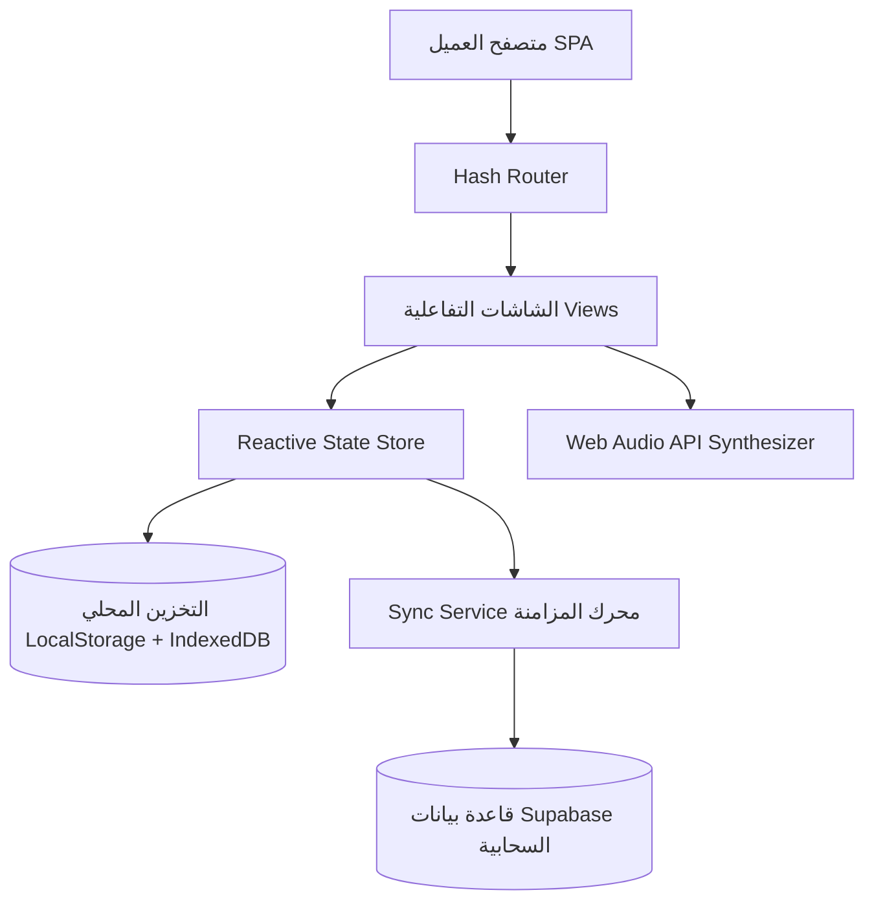

# ⚡ NEON COACH (نيون كوتش) - الدليل الفني والتشغيلي الشامل

> **المنصة الذكية المتكاملة للتدريب الرياضي، التغذية المحسوبة، وإدارة نمط الحياة الصحي**  
> مصممة بمعمارية **Offline-First** فائقة السرعة، وبواجهة سايبربانك نيون داكنة، مع محركات حسابية رياضية وبيولوجية دقيقة.

---

## 📑 فهرس المحتويات
1. [نظرة عامة على المشروع](#-نظرة-عامة-على-المشروع)
2. [المعمارية التقنية والتصميم البرمجي](#-المعمارية-التقنية-والتصميم-البرمجي)
3. [دليل الميزات التفصيلي (Feature-by-Feature)](#-دليل-الميزات-التفصيلي)
   - [3.1 نظام التوجيه والاستبيان الذكي (Smart Onboarding)](#31-نظام-التوجيه-والاستبيان-الذكي-smart-onboarding)
   - [3.2 شاشة اليوم ولوحة التحكم المركزية (Today Hub)](#32-شاشة-اليوم-ولوحة-التحكم-المركزية-today-hub)
   - [3.3 نظام التغذية وتتبع الماكروز وقاعدة الأطعمة (Nutrition & Meals)](#33-نظام-التغذية-وتتبع-الماكروز-وقاعدة-الأطعمة-nutrition--meals)
   - [3.4 مركز الوصفات الرياضية الصحية (Recipes Hub)](#34-مركز-الوصفات-الرياضية-الصحية-recipes-hub)
   - [3.5 نظام التدريب وبرنامج الـ 40 يوماً (Workout Engine)](#35-نظام-التدريب-وبرنامج-الـ-40-يوماً-workout-engine)
   - [3.6 مشغل الحصة التدريبية المباشر (Live Workout Session)](#36-مشغل-الحصة-التدريبية-المباشر-live-workout-session)
   - [3.7 متتبع شرب الماء والمكملات الغذائية (Hydration & Supplements)](#37-متتبع-شرب-الماء-والمكملات-الغذائية-hydration--supplements)
   - [3.8 تقرير التقدم والنتائج (Progress Report & Analytics)](#38-تقرير-التقدم-والنتائج-progress-report--analytics)
   - [3.9 التقييم الأسبوعي ولوحة المدرب (Weekly Check-in & Coach Dashboard)](#39-التقييم-الأسبوعي-ولوحة-المدرب-weekly-check-in--coach-dashboard)
   - [3.10 قائمة التسوق الذكية (Smart Shopping List)](#310-قائمة-التسوق-الذكية-smart-shopping-list)
   - [3.11 الحساب الشخصي والشارات والإنجازات (Profile & Gamification)](#311-الحساب-الشخصي-والشارات-والإنجازات-profile--gamification)
   - [3.12 الأنظمة التدريبية الإضافية (Hasm, Anas & 60-Day Challenge)](#312-الأنظمة-التدريبية-الإضافية-hasm-anas--60-day-challenge)
   - [3.13 نظام تتبع الكافيين والاستشفاء العصبي (Caffeine & Sleep)](#313-نظام-تتبع-الكافيين-والاستشفاء-العصبي-caffeine--sleep)
   - [3.14 محرك الأرشفة اليومية وتصفير منتصف الليل (Daily Snapshot & Streak)](#314-محرك-الأرشفة-اليومية-وتصفير-منتصف-الليل-daily-snapshot--streak)
   - [3.15 مشاركة الإنجاز وتصدير الـ PDF عبر Web Share API](#315-مشاركة-الإنجاز-وتصدير-الـ-pdf-عبر-web-share-api)
4. [محركات الحساب والمعادلات العلمية المعتمدة](#-محركات-الحساب-والمعادلات-العلمية-المعتمدة)
5. [الأمان، المزامنة السحابية وإدارة البيانات](#-الأمان-المزامنة-السحابية-وإدارة-البيانات)
6. [نظام المؤثرات الصوتية والإشعارات](#-نظام-المؤثرات-الصوتية-والإشعارات)
7. [هيكل المجلدات والملفات (Project Structure)](#-هيكل-المجلدات-والملفات-project-structure)
8. [دليل التطوير والتشغيل والاختبار](#-دليل-التطوير-والتشغيل-والاختبار)

---

## 🌟 نظرة عامة على المشروع

**NEON COACH** هو تطبيق ويب تقدمي (PWA / SPA) من الطراز الأول، تم بناؤه خصيصاً لتوفير تجربة تدريب وتغذية رياضية لا تضاهى. يعتمد التطبيق على:
* **الأداء الخارق والتحميل اللحظي (Zero Latency):** تخزين محلي كامل لقواعد البيانات والإعدادات عبر `localStorage` و `IndexedDB`، مما يتيح تشغيل التطبيق بالكامل حتى عند انقطاع الإنترنت.
* **الحفظ التلقائي للجميع:** حفظ بيانات المشترك سواء كان مسجلاً بحساب Google أو زائراً كضيف (Guest)، ومزامنتها بذكاء مع قاعدة بيانات Supabase الخلفية.
* **واجهة مستخدم احترافية (Dark Cyberpunk Neon UI):** سمة نيون داكنة متقدمة تحافظ على تركيز الرياضي، مع شريط تنقل سفلي ثابت ومتناسق على الهواتف والشاشات الكبيرة.
* **دقة حسابية صارمة:** معادلات تغذية وتدريب مستندة إلى أحدث الدراسات الرياضية (Mifflin-St Jeor, Katch-McArdle, Epley 1RM, Lyle McDonald Recomposition).

---

## 🛠 المعمارية التقنية والتصميم البرمجي



* **Core Stack:** Vanilla JavaScript (ES Modules الحديثة)، Vite 8.
* **Routing:** نظام توجيه Hash Router خفيف وسلس بدون إعادة تحميل الصفحة (`window.location.hash`).
* **State Management:** مخزن تفاعلي بنمط النشر والاشتراك (Reactive Pub/Sub Store) مع مزامنة فورية عبر نوافذ المتصفح المتعددة عبر `BroadcastChannel` و `Storage Events`.
* **Database & Sync:** Supabase PostgreSQL مع دعم سياسات أمان البيانات على مستوى الصفوف (Row Level Security - RLS).
* **Multimedia & Assets:** تخزين صور التمارين على شبكة سحابية فائقة السرعة Cloudflare R2، وتخزين صور التطور الجسدي للمستخدم محلياً داخل `IndexedDB` حفاظاً على الخصوصية التامة.
* **Audio Engine:** توليد نغمات وتنبيهات صوتية فورية باستخدام `AudioContext` بدون ملفات صوتية خارجية لتسريع بدء التطبيق بنسبة 100%.

---

## 🚀 دليل الميزات التفصيلي

### 3.1 نظام التوجيه والاستبيان الذكي (Smart Onboarding)
مسار استبيان متقدم متعدد الخطوات يُهيئ الخطة الكاملة للمشترك الجديد:
* **القياسات الأساسية:** الجنس، العمر، الطول، الوزن الحالي، والوزن المستهدف.
* **تحديد الهدف الأساسي:**
  1. *تنشيف وحرق الدهون (Fat Loss)*
  2. *بناء وضخامة عضلية (Hypertrophy / Bulk)*
  3. *إعادة تشكيل الجسم (Body Recomposition)*
  4. *المحافظة وتحسين اللياقة البدنية (Maintenance)*
* **مستوى النشاط الحركي:** من الخامل إلى شديد النشاط الرياضي مع معامل النشاط الفعلي (PAL).
* **نسبة دهون الجسم:** إمكانية إدخالها بدقة أو تقديرها تلقائياً.
* **التفضيلات الغذائية:** تحديد عدد الوجبات اليومية المفضلة (من 2 إلى 6 وجبات)، وحساسيات الطعام والمكونات المستبعدة.
* **الخبرة التدريبية وموقع التمرين:** (نادي رياضي Gym أو منزلي Home)، وتحديد المعدات المتوفرة (أوزان حرة، بار، أجهزة، وزن الجسم).
* **نظام استبعاد الإصابات والآلام الذكي:** رصد إصابات الكتف، الركبة، أو أسفل الظهر لاستبعاد التمارين المسببة للضغط على المفاصل المصابة واقتراح بدائل آمنة تلقائياً.

---

### 3.2 شاشة اليوم ولوحة التحكم المركزية (Today Hub)
المركز اليومي للرياضي لتتبع كل ما يحتاجه خلال يومه بلمحة واحدة:
* **بطاقة الدوافع والحالة النفسية التفاعلية:**
  تسمح للمتدرب باختيار مستوى طاقته وشعوره اليومي، لتعرض فوراً رسالة تحفيزية نفسية مخصصة وموجهة:
  * **ممتاز:** «قاعدين نقرّب أكثر من هدفنا 🔥»
  * **جيد:** «خطوة ثابتة اليوم بتقرّبنا من الهدف 💪»
  * **متوسط:** «حتى الطاقة المتوسطة تكفي للتقدم 🌟»
  * **منخفض:** «إنجاز بسيط اليوم أفضل من التوقف 🌱»
  * **مرهق:** «اسمع لجسمك اليوم—الراحة جزء أساسي من الوصول للهدف 💚»
* **حلقات السعرات والماكروز اليومية:** عدادات بصرية مضاءة نيون توضح (المستهلك / الهدف / المتبقي) من السعرات الحرارية، البروتين، الكاربوهيدرات، والدهون.
* **مؤشر استهلاك المياه السريع:** إضافة أكواب وزجاجات ماء بلمسة واحدة دون الحاجة لمغادرة الشاشة الرئيسية.
* **بطاقة تمرين اليوم:** استعراض الحصة التدريبية المجدولة مع زر بدء التمرين الفوري.
* **سجل الوجبات اليومية:** استعراض تفصيلي للوجبات المأكولة وإمكانية إضافة وجبة جديدة بسرعة.
* **عداد الأيام المتتالية (Streak Counter):** شعلة إنجاز نيون تُبرز الالتزام اليومي المتواصل وتحفيز الاستمرارية.

---

### 3.3 نظام التغذية وتتبع الماكروز وقاعدة الأطعمة (Nutrition & Meals)
نظام تغذية رياضي احترافي فائق الدقة:
* **قاعدة بيانات تضم 552 صنفاً غذائياً:**
  * تشمل الأكلات الشعبية العربية والمكونات الرياضية العالمية.
  * قائمة الـ 121 صنفاً أساسياً المعتمدة ذات الماكروز المؤكدة معملياً.
* **ذكاء وحدات القياس الدقيق:**
  * **السوائل:** حليب، عصائر، مشروبات تُقاس بالمليلتر (**مل**).
  * **الأطعمة الصلبة:** أرز، لحوم، دجاج، مكسرات، شوفان تُقاس بالغرام (**غم**).
  * **الأصناف بالعدد:** حساب دقيق لحبات البيض (البيضة الكاملة = 50غ، بياض البيض = 33غ، صفار البيض = 17غ).
* **محرك البحث الذكي والنصوص العربية:**
  * تطبيع تلقائي لكافة أشكال الهمزات (`أ`، `إ`، `آ`، `ا`)، والتاء المربوطة والهاء (`ة`، `ه`)، والياء والألف المقصورة (`ي`، `ى`).
  * إزالة التشكيل والرموز لضمان العثور على أي صنف بأي طريقة كتابة.
* **نظام إضافة وتعديل الأطعمة المخصصة (Custom Food Manager):**
  * إضافة أي طعام غير موجود باسمه، وحجم حصته، وسعراته، وماكروزه.
  * إمكانية البحث عن الأطعمة المضافة وتعديل بياناتها لاحقاً أو حذفها مع نافذة تأكيد آمنة.
* **توزيع الوجبات المرن:** فطور، غداء، عشاء، سناكات، وجبة قبل التمرين، ووجبة بعد التمرين.
* **إدارة الوجبات بعد الحفظ:** بعد إضافة الوجبة يمكن للمستخدم تعديل كمياتها، أو إضافة أصناف جديدة إليها مباشرة، أو حفظها بنقرة واحدة إلى **«الوجبات المفضلة»** لإعادة استخدامها مستقبلاً.
* **التخصيص اليدوي للماكروز:** إمكانية تعديل الهدف اليومي من السعرات وتوزيع الماكروز يدوياً بنسب مخصصة حسب رغبة المتدرب أو مدربه.

---

### 3.4 مركز الوصفات الرياضية الصحية (Recipes Hub)
شاشة مخصصة في الشريط السفلي (`#recipes`) بأيقونة كتاب الوصفات النيون:
* **16 وصفة رياضية محسوبة بدقة:**
  * مصنفة حسب الوجبات: فطور، غداء، عشاء، سناك وحلويات صحية، ووصفات عالية البروتين.
  * أكلات عربية وعالمية شهيرة (شوفان البروتين، شاورما الدجاج الصحية، بان كيك البروتين، برجر اللحم الصافي، سالمون مشوي، ماج كيك الشوكولاتة، وغيرها).
* **فلاتر سريعة وتمرير سلس:** تصفية فورية حسب نوع الوجبة أو نسبة البروتين، مع شريط بحث فوري.
* **بطاقات الوصفات التفاعلية:** عرض السعرات، البروتين، الكارب، الدهون، مدة التحضير، ومستوى الصعوبة.
* **نافذة تفاصيل الوصفة المتكاملة:**
  * **قائمة المقادير التفاعلية (Checklist):** إمكانية شطب المكونات أثناء التحضير في المطبخ.
  * **خطوات التحضير المرتبة:** شرح خطوة بخطوة للطهي الصحي.
  * **زر «إضافة إلى وجبات اليوم» بلمسة واحدة:** يقوم تلقائياً بترحيل السعرات والماكروز لسجل اليوم.
  * **زر «حفظ في المفضلة»:** للوصول السريع إلى الوجبة في أي وقت.

---

### 3.5 نظام التدريب وبرنامج الـ 40 يوماً (Workout Engine)
محرك تدريبي ديناميكي يولد جداول تدريبية احترافية تناسب أي جدول زمني:
* **تقسيمات تدريبية من 1 إلى 6 أيام أسبوعياً:**
  * جداول (Push / Pull / Legs)، وجداول (Upper / Lower)، وجداول (Full Body)، وجداول التقسيم العضلي المتقدم (Arnold Split).
* **مكتبة تمارين شاملة مع الرسوم التوضيحية:**
  * شرح عربي دقيق للتكنيك الصحيح لكل تمرين، مع العضلات المستهدفة والمساعدة.
  * ربط التمارين بروابط صور متحركة ورسوم توضيحية مستضافة على شبكة Cloudflare R2 السحابية.
* **نظام التبديل الآمن عند الإصابة:**
  * استبعاد آلي للتمارين التي تضغط على الكتف أو الركبة أو أسفل الظهر عند تحديد إصابة في الاستبيان، واستبدالها بحركات بديلة آمنة.
* **مراحل الإحماء والتهدئة:** إرشادات إحماء ديناميكي مخصصة لكل يوم تدريبي وتمارين إطالة وتهدئة لمنع الإصابات.

---

### 3.6 مشغل الحصة التدريبية المباشر (Live Workout Session)
واجهة تفاعلية تُرافق المتدرب داخل الصالة الرياضية خطوة بخطوة (`#workout-session`):
* **تسجيل المجموعات (Set-by-Set Logging):** تسجيل الوزن المحمول (كغ)، التكرارات المنجزة (Reps)، ومعدل الجهد البدني (RPE من 1 إلى 10).
* **مؤقت الراحة التفاعلي الذكي:**
  * عد تنازلي مرئي بين المجموعات.
  * تنبيهات صوتية مميزة عبر Web Audio API عند انتهاء وقت الراحة.
* **محرك زيادة الأوزان التدريجية (Progressive Overload Advisor):**
  * تحليل أداء المتدرب الفعلي؛ إذا أنجز التكرارات بجهد RPE منخفض، يقترح التطبيق تلقائياً زيادة الوزن في المجموعة أو الحصة القادمة.
* **حاسبة القوة القصوى (1RM Calculator):** احتساب أقصى وزن يمكن رفعه لتكرار واحد اعتماداً على معادلة إيبلي (Epley Formula).
* **تبديل التمرين أثناء التمرين:** إمكانية استبدال أي تمرين بلحظات في حال كانت الأجهزة في النادي مشغولة.

---

### 3.7 متتبع شرب الماء والمكملات الغذائية (Hydration & Supplements)
* **تتبع الترطيب واستهلاك المياه اليومي:**
  * احتساب الاحتياج اليومي الأدنى بناءً على وزن الجسم ومستوى المجهود البدني والتعرق.
  * أزرار إضافة سريعة: كوب (250 مل)، زجاجة (500 مل)، قارورة كبيرة (1000 مل)، أو كمية مخصصة.
  * زر تراجع ذكي لإلغاء الإضافة في حال الخطأ.
  * **معاملات المواد المؤثرة على الجفاف (Dehydration Factors):** حساب تعويض المياه الإضافية عند استهلاك المنبهات كالكافيين أو أثناء التدريبات المكثفة.
* **قاعدة بيانات المكملات الغذائية (70+ مكملاً):**
  * معلومات تفصيلية عن الكرياتين، البروتين، الأوميغا 3، الفيتامينات، المغنيسيوم، الأشواغاندا، وغيرها.
  * بحث ذكي ثنائي اللغة (عربي / إنجليزي) بالاسم العلمي والأسماء الشائعة.
  * **نوافذ التوقيت الأربعة لتناول المكملات:**
    1. الصباح (Morning)
    2. مع الغداء (Lunch)
    3. المساء وقبل النوم (Evening)
    4. أي وقت من اليوم (Anytime)
  * مربعات تأكيد يومية لحفظ جرعات اليوم وملاحظات علمية حول التوافر الحيوي لكل مكمل.

---

### 3.8 تقرير التقدم والنتائج (Progress Report & Analytics)
تم دمج هذا القسم ببراعة ليكون **داخل شاشة حسابي تحت الشارات والإنجازات مباشرة**، مع زر رجوع نيون علوي للعودة السريعة:
* **تتبع تطور وزن الجسم:**
  * تسجيل القياسات مع التاريخ والوقت.
  * منحنى بياني انسيابي مرسوم بـ SVG Path ناعم يوضح اتجاه نزول أو صعود الوزن.
  * احتساب المتوسط المتحرك لـ 7 أيام وفارق التغير الأسبوعي (+ / - كغ).
* **نموذج إعادة تشكيل الجسم (Lyle McDonald Recomposition Model):**
  * تقدير التغيرات في الكتلة العضلية الصافية مقابل كتلة الدهون.
* **قياسات فحص InBody ومحيطات الجسم:**
  * تسجيل نسبة الدهون، الكتلة العضلية الهيكلية (SMM)، مؤشر كتلة الجسم (BMI)، ومستوى الدهون الحشوية.
  * تتبع محيط الخصر، الصدر، الذراعين، والفخذين.
* **استوديو صور التطور غير المتصل (Offline Private Photos):**
  * حفظ صور التقدم مباشرة في متصفح المتدرب عبر `IndexedDB` محلياً دون رفعها لأي سيرفر للحفاظ على الخصوصية الكاملة.
  * مقارنة الصور (قبل وبعد) من الأمام والجانب والخلف.
* **سجل تاريخ التمارين:** استعراض الحصص السابقة والأرقام القياسية الشخصية المسجلة.
* **تصدير وطباعة التقرير:** تنسيق أنيق مهيأ للطباعة وتصدير ملفات PDF لمشاركتها مع المدرب.

---

### 3.9 التقييم الأسبوعي ولوحة المدرب (Weekly Check-in & Coach Dashboard)
* **المراجعة الأسبوعية الذكية (`#checkin`):**
  * نموذج أسبوعي يرصد التزام المتدرب، جودة النوم، مستويات الجوع، ومعدل الطاقة.
  * تقديم اقتراحات آلية لتعديل السعرات الحرارية أو النشاط الهوائي (الكارديو) بناءً على سرعة الاستجابة الجسدية.
* **لوحة تحكم المدرب (`#coach`):**
  * للمدربين لمتابعة تقدم عدة لاعبين، رصد معدلات الالتزام، والتنبيه التلقائي للمشتركين الذين يواجهون ثباتاً في الوزن.

---

### 3.10 قائمة التسوق الذكية (Smart Shopping List)
* إنشاء قائمة مشتريات أسبوعية آلية استناداً إلى الوجبات والوصفات المجدولة.
* تصنيف المكونات حسب الأقسام (الخضار والفواكه، اللحوم والدواجن، منتجات الألبان، الحبوب والشوفان، المكملات).
* شطب الأصناف المشتراة أثناء التسوق في السوبرماركت بلمسة واحدة.

---

### 3.11 الحساب الشخصي والشارات والإنجازات (Profile & Gamification)
* **ملخص البيانات والملف الشخصي:** استعراض معدل الحرق اليومي (BMR)، واستهلاك الطاقة الكلي (TDEE)، والوزن والهدف.
* **نظام الأوسمة والشارات (Achievement Badges):**
  * شارات الالتزام بالأيام المتتالية (Streak).
  * شارات تسجيل الوجبات والماء.
  * شارات الوصول لأهداف الوزن ورفع الأوزان.
* **زر «التقدم والنتائج»:** مدمج مباشرة تحت الشارات للانتقال المباشر لتقرير النتائج.
* **إدارة الإعدادات والبيانات:**
  * تبديل وحدات القياس (متري كغ/سم - إمبراطوري باوند/إنش).
  * تصدير واستيراد نسخة احتياطية كاملة من البيانات بصيغة JSON.
  * خيار إعادة ضبط وتصفير البيانات بأمان.

---

### 3.12 الأنظمة التدريبية الإضافية (Hasm, Anas & 60-Day Challenge)
بالإضافة إلى الخطة الديناميكية للـ 40 يوماً، يتضمن المشروع بروتوكولات تدريبية احترافية مستقلة ومخصصة:
* **نظام الحسم (Hasm System - `hasmWorkout.js`):**
  * بروتوكول تدريبي عالي الكفاءة يركز على استثمار الوقت القليل وتحقيق أقصى استجابة عضلية.
  * مقسم إلى 4 مجموعات عضلية رئيسية: (صدر وبايسبس، ظهر وترايسبس، أرجل وبطات، أكتاف وبطن).
  * يحتوي على 30 تمريناً أساسياً مشروحاً ومربوطاً بصفحات كتاب الحسم وصور Cloudflare R2 التوضيحية.
* **نظام أنس التدريبي (Anas 5-Day Workout System - `anasWorkout.js`):**
  * خطة تدريبية مكثفة لأبطال كمال الأجسام مقسمة على 5 أيام تدريبية أسبوعياً:
    1. السبت: *Push (دفع - صدر، أكتاف، ترايسبس)*
    2. الأحد: *Pull (سحب - ظهر، بايسبس، كتف خلفي)*
    3. الإثنين: *Legs (أرجل، بطات، أوتار)*
    4. الثلاثاء: *Upper (جزء علوي شامل وتكثيف)*
    5. الأربعاء: *عزل الأكتاف والبطن والسواعد*
* **بوابة تحدي الـ 60 يوماً (60 Days Challenge Portal):**
  * بيئة تحول بدني مكثفة مجهزة بصفحة ويب مستقلة تفاعلية للمشتركين الذين يرغبون في التزام حديدي لمدة شهرين كاملين.

---

### 3.13 نظام تتبع الكافيين والاستشفاء العصبي (Caffeine & Sleep)
ملف نظام مستقل ومتخصص (`caffeine.html`) لإدارة المنبهات والجهاز العصبي:
* **حاسبة عمر النصف للكافيين (Caffeine Half-Life Model):** احتساب تفكك الكافيين في مجرى الدم تدريجياً (متوسط 5 إلى 7 ساعات).
* **رصد مصادر الكافيين المتنوعة:** الإسبريسو، القهوة المقطرة، مشروبات الطاقة، الشاي، والمكملات قبل التمرين (Pre-Workout).
* **مؤشر أمان النوم العميق (Sleep Readiness Window):** تحذير الرياضي من تناول المنبهات في الساعات المتأخرة لتجنب إفساد نوم الموجات البطيئة (SWS) الذي يُفرز فيه هرمون النمو (GH).

---

### 3.14 محرك الأرشفة اليومية وتصفير منتصف الليل (Daily Snapshot & Streak)
تمت برمجته داخل `src/domain/dailyCycle.js`:
* **أخذ لقطة اليوم (Snapshot):** عند حلول منتصف الليل أو دخول يوم تقويمي جديد، يقوم النظام بجمع كافة مدخول اليوم بدقة (سعرات، بروتين، ماكروز، مياه، مكملات متناولة، حالة إتمام التمرين، ومستوى الطاقة المختار) وحفظها بسجل التطور التاريخي.
* **إعادة التعيين التلقائية النظيفة:** تفريغ عدادات السعرات والمياه اليومية ومربعات المكملات مع الحفاظ التام على أرقام الـ Streak وسجل الأيام السابقة.

---

### 3.15 مشاركة الإنجاز وتصدير الـ PDF عبر Web Share API
تمت برمجته في `src/services/pdfService.js`:
* **المشاركة السريعة مع المدرب والأصدقاء (Web Share API):**
  * زر مشاركة يولد بطاقة نصية أنيقة ملخصة تتضمن (تغير الوزن، قوة رفعة البنش بريس، نسبة التزام التدريب، والتزام التغذية والماء).
  * تفتح مباشرة قائمة المشاركة الأصلية في الهاتف (WhatsApp, Telegram, Messages) مع نسخ تلقائي للحافظة كـ Fallback.
* **وضع الطباعة الرسمي (Print Mode):** إخفاء عناصر التحكم والأزرار (`no-print`) لعرض تقرير بياني نقي مهيأ للطباعة أو الحفظ كـ PDF.

---

## 📐 محركات الحساب والمعادلات العلمية المعتمدة

تمت برمجة جميع العمليات الحسابية داخل مجلد `src/domain/` وفق معايير الطب الرياضي والتغذية الإكلينيكية:

| المحرك الحسابي | المعادلة / المرجع | الاستخدام في التطبيق |
|---|---|---|
| **BMR (معدل الحرق الأساسي)** | **معادلة Mifflin-St Jeor**<br>`للرجال: 10×الوزن + 6.25×الطول - 5×العمر + 5`<br>`للنساء: 10×الوزن + 6.25×الطول - 5×العمر - 161` | حساب استهلاك الطاقة الأساسي في حالة الراحة التامة |
| **BMR مع نسبة الدهون** | **معادلة Katch-McArdle**<br>`370 + (21.6 × الكتلة العضلية الصافية LBM)` | احتساب حرق الطاقة بدقة مضاعفة عند توفر نسبة الدهون |
| **TDEE (حرق الطاقة اليومي)** | `BMR × Activity Multiplier (1.2 to 1.9)` | تحديد السعرات الكلية اللازمة لثبات الوزن |
| **عجز وفائض السعرات** | تنشيف: `-300 إلى -600 سعرة`<br>تضخيم: `+250 إلى +450 سعرة` | ضمان نزول دهون بدون خسارة عضلية، أو بناء عضل بأقل دهون |
| **البروتين المستهدف** | `1.8 - 2.4 غرام / كغ` من وزن الجسم | دعم تخليق البروتين العضلي وتفادي الهدم |
| **الدهون الصحية** | `0.7 - 1.0 غرام / كغ` (الحد الأدنى لسلامة الهرمونات) | الحفاظ على إفراز التيستوستيرون وصحة المفاصل |
| **حساب القوة القصوى (1RM)** | **معادلة Epley**<br>`Weight × (1 + Reps / 30)` | تقدير القوة العضلية القصوى دون تعريض المتدرب لخطر الإصابة |
| **إعادة تشكيل الجسم** | **نموذج Lyle McDonald Recomposition** | تقدير نسب اكتساب العضلات وخسارة الدهون الأسبوعية |

---

## 🔒 الأمان، المزامنة السحابية وإدارة البيانات

1. **استقلالية تامة عن الإنترنت (Offline-First):**
   * التطبيق يعمل بكامل طاقته وميزاته حتى بدون اتصال إنترنت.
   * التعديلات تُحفظ فورياً في `localStorage` مع تشفير وتدقيق بنية البيانات عبر الـ Schema.
2. **المزامنة السحابية مع Supabase:**
   * مزامنة خلفية هادئة عند توفر الإنترنت عبر `src/services/syncService.js`.
   * سياسات أمان Row Level Security (RLS) تضمن أن كل مستخدم لا يستطيع القراءة أو الكتابة إلا على بياناته الخاصة فقط.
3. **حفظ بيانات الزائر والضيف (Guest Fallback):**
   * المستخدم غير المسجل بجوجل يتم تعيين معرّف مشفر له وحفظ تقدمه محلياً وسحابياً دون إجباره على تسجيل الدخول.
4. **المزامنة بين التبويبات (Cross-Tab Synchronization):**
   * عند فتح التطبيق في أكثر من نافذة، يتم إشعار وتحديث البيانات فوراً عبر `BroadcastChannel` و `actionToastService.js`.

---

## 🔊 نظام المؤثرات الصوتية والإشعارات

* **توليد صوتي داخلي بدون ملفات (Web Audio API):**
  * تم بناء `src/services/neonSoundService.js` لإنتاج ترددات ونغمات نيون إلكترونية ناعمة مباشرة عبر برمجية الصوت بالمتصفح (`OscillatorNode`).
  * نقرات الأزرار، نغمات النجاح عند تسجيل وجبة أو تمرين، وصفارة انتهاء مؤقت الراحة.
* **نظام الإشعارات النيون (Neon Toasts):**
  * إشعارات منبثقة عصرية بألوان متناسقة، تُعلم المشترك بالإجراءات وحالات الحفظ والمزامنة دون مقاطعة استخدامه للتطبيق.

---

## 📂 هيكل المجلدات والملفات (Project Structure)

```text
neon-coach/
├── src/
│   ├── components/            # المكونات المشتركة
│   │   ├── header.js          # ترويسة التطبيق العلوية
│   │   ├── navBar.js          # شريط التنقل السفلي الثابت (5 تبويبات)
│   │   ├── customFoodModal.js # نافذة إضافة وتعديل صنف طعام جديد
│   │   └── ...
│   ├── data/                  # قواعد البيانات الثابتة
│   │   ├── foods.js           # قاعدة بيانات الأطعمة (552 صنفاً)
│   │   ├── curatedFoods121.js # قائمة الـ 121 صنفاً المعتمدة
│   │   ├── exercises.js       # مكتبة التمارين الرياضية والشروحات
│   │   ├── recipesData.js     # قاعدة بيانات الوصفات الرياضية (16 وصفة)
│   │   ├── supplementsDb.js   # قاعدة بيانات المكملات (70+ مكملاً)
│   │   └── fortyDayWorkout.js # برنامج الـ 40 يوماً التدريبي
│   ├── domain/                # المنطق الحسابي والرياضي الصافي
│   │   ├── calculations.js    # حاسبات الطاقة والمعدلات الحيوية
│   │   ├── nutritionCalculations.js # معادلات توزيع الماكروز
│   │   └── compositionEstimate.js   # نموذج تقدير تركيب الجسم
│   ├── router/                # نظام التوجيه
│   │   └── router.js          # موجه الـ Hash Router والتحكم بالصفحات
│   ├── services/              # الخدمات الخلفية والمزامنة
│   │   ├── authService.js     # إدارة المصادقة وجلسات المستخدم
│   │   ├── syncService.js     # محرك المزامنة التلقائية مع Supabase
│   │   ├── localPhotoStorage.js # التخزين المحلي الآمن لصور التقدم
│   │   ├── neonSoundService.js# نظام الصوت التخليقي
│   │   └── actionToastService.js# مزامنة التنبيهات بين النوافذ
│   ├── state/                 # إدارة الحالة المركزية
│   │   └── store.js           # الـ Store التفاعلي المشترك
│   ├── styles/                # ملفات التنسيق والمظهر
│   │   ├── components.css     # تنسيقات المكونات والسمة النيون
│   │   ├── base.css           # الأساسيات والمتغيرات اللونية
│   │   └── layout.css         # الهيكل وتجاوب الشاشات
│   ├── views/                 # شاشات التطبيق الرئيسية
│   │   ├── todayView.js       # شاشة اليوم ولوحة التحكم
│   │   ├── nutritionView.js   # شاشة التغذية والوجبات
│   │   ├── fortyDayWorkoutView.js # جدول التمارين وبرنامج الـ 40 يوماً
│   │   ├── recipesView.js     # شاشة الوصفات الصحية المضافة حديثاً
│   │   ├── profileView.js     # شاشة حسابي والأوسمة وزر التقدم
│   │   ├── progressReportView.js # تقرير وتاريخ التقدم والنتائج
│   │   ├── workoutSessionView.js # مشغل جلسة التمرين الحية
│   │   ├── waterSuppsView.js  # متتبع المياه والمكملات
│   │   ├── questionnaireView.js # الاستبيان الأولي
│   │   └── ...
│   ├── index.html             # الصفحة الرئيسية للتطبيق
│   └── main.js               # نقطة الانطلاق وبدء تشغيل التطبيق
├── tests/                     # منظومة الاختبارات الآلية الشاملة (91 اختباراً)
├── database/
│   └── schema.sql             # هيكل جداول قاعدة البيانات وسياسات RLS
├── package.json               # التبعيات وأوامر التشغيل
└── vite.config.js             # إعدادات حزمة Vite
```

---

## 💻 دليل التطوير والتشغيل والاختبار

### المتطلبات الأساسية
* **Node.js** بإصدار `v22.12` أو أحدث.
* مدير الحزم **npm**.

### 1. تثبيت الحزم البرمجية
```bash
npm install
```

### 2. تشغيل بيئة التطوير المحلية
```bash
npm run dev
```
سيبدأ خادم التطوير السريع على الرابط المحلي (غالباً `http://localhost:5173`).

### 3. تشغيل حزمة الاختبارات الآلية (Automated Tests)
يحتوي المشروع على حزمة اختبارات شاملة تغطي محركات الحساب، البحث، التخزين، المزامنة، وتوليد البرامج:
```bash
npm test
```
> ناتج الاختبار الحالي: **91 من 91 اختباراً ناجحة بنسبة 100%**.

### 4. بناء نسخة الإنتاج (Production Build)
```bash
npm run build
```
يقوم Vite بضغط وتقسيم الأصول وتوليد مجلد `dist/` جاهز للنشر السحابي الفوري.

---

<div align="center">
  <b>⚡ NEON COACH — صُنع بشغف لتمكين أبطال اللياقة البدنية من أداء لا حدود له ⚡</b>
</div>
