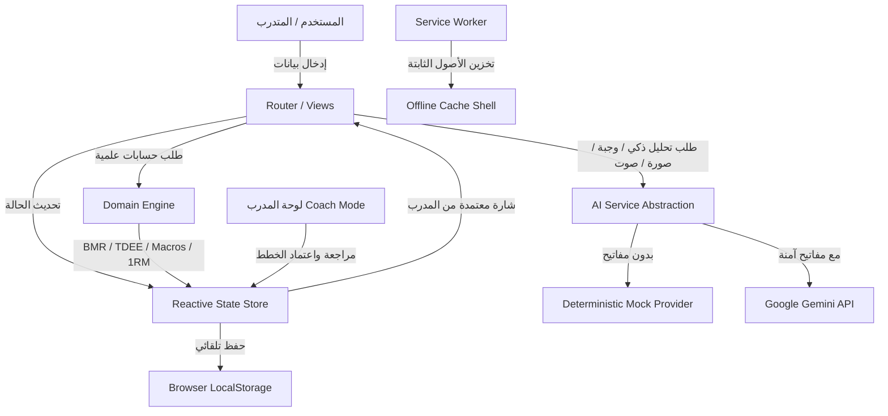

# المعمارية التقنية لتطبيق NEON COACH (System Architecture)

تطبيق **NEON COACH** مبني كـ Frontend PWA مستقل بالكامل باستخدام **Vanilla HTML5 + Modern CSS + JavaScript (ES Modules)** مع **Vite** كبيئة تطوير وبناء بدون أي اعتماد على أطر عمل ثقيلة مثل React أو Vue.

---

## 1. مبادئ المعمارية (Core Architectural Principles)

1. **Deterministic Domain Logic (الحسابات الحتمية)**:
   كافة الحسابات الرياضية والفسيولوجية (BMR, TDEE, Macros, e1RM, BMI, نسب الحلقات الدائرية) تُنفذ عبر كود رياضي حتمي مستقل تماماً عن واجهة المستخدم في `src/domain/calculations.js`.
2. **Offline-First & Local Storage Persistence (تخزين محلي آمن)**:
   حالة التطبيق، خطط التدريب، سجلات الوجبات، ومتابعات المدرب تُحفظ وتُسترجع محلياً داخل `localStorage` عبر `src/state/store.js` دون الاعتماد على خوادم خارجية للتشغيل الأساسي.
3. **Multi-Provider AI Abstraction (طبقة تجريد الذكاء الاصطناعي)**:
   خدمة `src/services/aiService.js` تفصل واجهة المستخدم عن أي مزود خارجي (Gemini / OpenAI)، مع توفير محاكي محلي ذكي (Smart Deterministic Mock) يضمن عمل التطبيق بنسبة 100% في وضع Demo وبدون الحاجة لمفاتيح سرية.
4. **Resilient Session Timers (مؤقتات دقيقة مقاومة لإغلاق المتصفح)**:
   مؤقتات الجلسة والراحة تعتمد على فوارق الـ Timestamps الحقيقية (`Date.now()`)، مما يحافظ على دقتها حتى بعد تصغير التطبيق أو قفل شاشة الهاتف أو إعادة تحميل الصفحة.

---

## 2. مخطط تدفق البيانات والعمليات (Data Flow Diagram)

---

## 3. هيكل الوحدات البرمجية (Module Breakdown)

- `src/domain/`:
  - `calculations.js`: معادلات Mifflin-St Jeor، Epley 1RM، الماكروز والماء.
  - `planner.js`: مولد قوالب التدريب لـ 1 إلى 6 أيام وموانع الإصابات.
  - `nutritionEngine.js`: محرك تبديل الوجبات وتحليل النصوص وقائمة المشتريات.
- `src/state/`:
  - `store.js`: المخزن المركزي المعتمد على نمط النشر والاشتراك (Pub/Sub).
  - `demoData.js`: البيانات المتكاملة لشخصية أحمد المتطابقة مع الصور العشر.
- `src/services/`:
  - `aiService.js`: واجهة مهام الذكاء الاصطناعي مع معالجة الأخطاء.
  - `timerService.js`: مؤقت الثواني للجلسات وفترات الراحة والتنبيه الصوتي.
  - `speechService.js`: التعرف الصوتي العربي عبر Web Speech API.
  - `pdfService.js`: تصدير وطباعة تقرير الـ PDF ومشاركته.
  - `notificationService.js`: إشعارات Web Notification والـ Toast الداخلي.
- `src/views/`:
  - 12 واجهة معيارية متطابقة بالكامل مع الصور العشر للمشروع وشاشات الإدارة.
