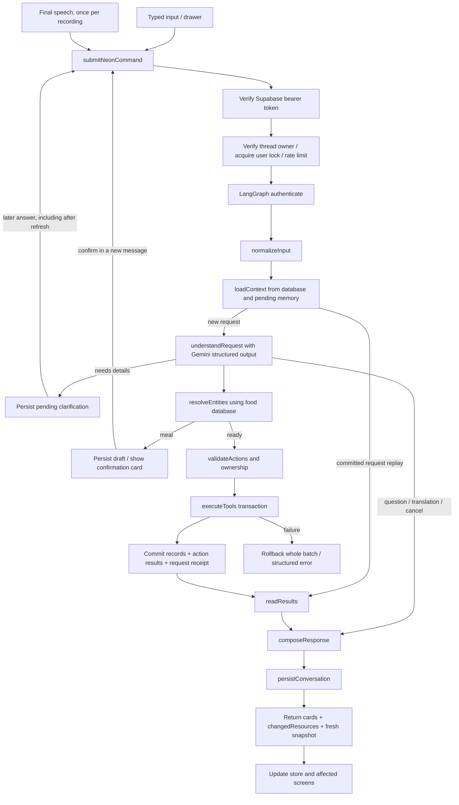

# NEON AI — local execution report

## Verification status

The active NEON AI path now runs an authenticated backend LangGraph, validates registered tools, commits application changes and an idempotency receipt together, reads database state, and renders persisted results. Text, final speech, the drawer, and the floating voice overlay use the same dispatcher.

**Full Supabase Local + live microphone + live Gemini end-to-end acceptance remains unverified.** Supabase CLI startup failed because neither Docker nor Podman is installed. No production database was used as a substitute.

Verified separately:

- 66 passing Node tests, including isolated PostgreSQL/PGlite integration, RLS, durable PostgresSaver reopening, rollback, idempotency, speech-event and sound tests.
- Ten live Gemini understanding cases passed across two batches. A provider HTTP 429 interrupted the first batch; the remaining cases passed later. These calls used synthetic phrases and did not write a Supabase database.
- Real Edge browser, real frontend dispatcher, real graph, real isolated SQL database: typed water, simulated final speech, duplicate speech prevention, meal draft, refresh, confirmation, nutrition-screen update and persisted records after reopening. Authentication and model were mocked, and the browser API transport was intercepted by the test runner.
- Desktop 1280×900, phone 390×844 and tablet 820×1180 screenshots. No JavaScript page errors in the passing browser run.
- Vite production build passed. Existing bundle-size/dynamic-import warnings remain.

## Verified root causes and old execution paths

The working copy was already dirty on `main`. Its initial modifications and untracked LangGraph code were inspected before editing. Backup copies of the earlier API, agent, view and sound tests are in the ignored `scratch/neon-before-secure-fix/` directory.

1. `src/views/neonAiView.js` submitted typed text to `neonActionAgent.handleUserUtterance`. The existing agent tried the API, swallowed failures, then fell back to `parseNaturalAction`, `_executeSingleTool`, or `aiService.chatWithCoach`. This made phrase recognition depend on the parser and allowed provider/backend failure to enter a different execution path.
2. `api/langgraph/nodes/understandRequest.js` itself consisted largely of regex branches. Adding LangGraph had not added model-based natural-language understanding.
3. The old `api/action-agent.js` accepted `body.userId || 'local_user'` and browser context. The old authenticate node used that identity and checked a globally keyed idempotency cache before ownership.
4. The old `executeTools` cloned `clientState` and changed arrays and counters. It did not insert application database rows. `readResults` used that state, and `composeResponse` could emit a generic successful execution response without confirmed persistence.
5. The frontend installed `updatedState`, saved browser storage, and launched water synchronization without awaiting it. Meals and weight were not durably saved by that path.
6. Voice did reach the agent in this local copy, so the code does **not** support a blanket claim that voice never called the API. However, the agent emitted terminal outcomes only through `state_change`, while the NEON AI view waited for separate `success`/`clarification` events. A voice request could therefore finish without the view rendering its result.
7. Interim speech was eligible for execution through pause timers, silence handling and the stop button, independently of final speech events. The floating voice overlay had the same cancellation problem.
8. `aiDrawer.js` submitted directly to `chatWithCoach` and used locally generated meal-confirmation handlers. It was a competing input/execution path.
9. The router explicitly redirected away from `#auth`, and the authentication route was absent. The backend requirement could not be satisfied through that UI until the route was restored.
10. Browser verification exposed a database date representation mismatch: nutrition totals appeared, but the meal's date failed the screen's day filter. Repository rows now normalize dates and numeric nutrient fields.

Legacy parser/domain files and the old graph/node files remain for review and compatibility. The active `/api/action-agent` imports `localBackend.js`, then `runtime.js`; it does not import the old graph or file checkpointer. No active NEON command input calls the legacy local executor. `actionPanel` retains old definitions but is not mounted by the current router.

## New execution path and graph



`runtime.js` compiles a real `StateGraph` with conditional edges. Credentials, database clients, provider keys and authentication callbacks are closures, not checkpoint state. Its state includes request/thread/verified identity, normalized input/source, context, bounded recent messages, summary, pending action, plan, action IDs, results, snapshot and response. Request and model output schemas are validated with Zod.

The graph uses the existing Gemini provider. Structured output is a proposal only; `validateAction` and registered server handlers are responsible for execution. There is no parser fallback that turns an unavailable backend into a successful local write.

## Persistence and isolation

- Actual records: existing `meal_logs`, `water_logs`, `inbody_records`, `workout_logs`, `shopping_items`, and `profiles`.
- Recent conversation: `neon_threads.messages`, bounded to 20 messages.
- Long conversation summary: separate bounded extractive `neon_threads.summary`, up to 3,000 characters.
- Pending clarification or meal draft: `neon_threads.pending`, with its own UUID, immutable proposed batch and 24-hour expiry. Confirmation accepts only the current owned pending ID. Cancel saves no meal. Later clarification may complete, replace, keep or cancel a pending request.
- User preferences: existing profile records, including a profile timezone; they are not inferred from conversation totals.
- Graph checkpoints: official `PostgresSaver` in private schema `neon_checkpoints`. Checkpoint keys include verified user, thread and request UUIDs. User/thread ownership is verified before graph checkpoint access.
- Execution receipts: `neon_requests`, keyed by verified owner and request UUID, containing input hash, structured results and reversible effects.
- Rate events: `neon_rate_events`, limited to 12 authenticated endpoint requests per minute per user.

The server verifies bearer tokens through Supabase `auth.getUser`. It rejects browser-supplied identity/context fields via the strict command schema. Tool arguments cannot contain arbitrary SQL, JavaScript, database tables or a user ID. CRUD uses a server-owned table/column allowlist and parameterized values, always scoped to the verified owner.

Transactions use the `neon_agent` NOLOGIN database role, inheriting authenticated application access and RLS. Browser `authenticated` users can read owned journal records but cannot insert/update/delete execution receipts or pending requests. Additional restrictive owner policies prevent permissive policies from broadening access to the applicable application and agent tables. Checkpoint schema access is revoked from API roles.

No provider key is used by the command frontend, stored by its API-key settings, or prefixed with `VITE_`. Production fallback Supabase URL/key literals were removed from `supabaseClient.js`. Backend execution refuses non-loopback database and Supabase URLs in this local task. Existing `.env.local` provider settings were preserved; `.env.neon.local` supplies the isolated local overrides and is ignored by Git.

## Duplicate prevention and failure behavior

- One UUID per independent typed request; one UUID per recording.
- Interim transcripts never dispatch. Repeated final events and concurrent submit clicks are suppressed. Stop/cancel discards the recording.
- The dispatcher retains the exact request in session storage for explicit retry after a transport failure. New independent identical text gets a different UUID.
- A per-user PostgreSQL advisory lock serializes backend requests across tabs/workers. Busy requests receive a retryable error.
- Entire multi-tool batches are transactional. A failed action rolls back the batch; no complete-success or partial-success claim is emitted for an uncommitted batch.
- Application changes, execution results and the request receipt commit together. A consumed meal draft is cleared in that transaction.
- Replay first checks owner, thread and input hash. Committed execution results bypass the model/tools, including after graph checkpoint or final-response failure.
- Response composition has a deterministic fallback from tool results. Success sounds occur only after a confirmed voice write result; no microphone-start success sound remains.
- Undo checks the latest reversible request and refuses if a affected record has changed since it was written. It does not replace the entire application state.
- The command path requires online database confirmation; it does not implement an offline write queue. It does not claim `pending_sync` as account persistence.

Limits: 4,000 message characters, 32 KiB HTTP body, six actions/tool calls, graph recursion limit 24, a 45-second execution deadline checked before new work/commit, 25-second provider timeout, eight-second SQL statement timeout and zero automatic provider/tool retries. In-flight SQL cleanup/readback can extend beyond the execution deadline; this is not a hard wall-clock process termination.

## Tools and interface checks

Implemented handlers: `searchFoods`, `getFoodNutrition`, `addMeal`, `updateMeal`, `deleteMeal`, `getDailyNutritionSummary`, `logWater`, `updateWater`, `getWaterSummary`, `logWeight`, `updateWeight`, `getWeightProgress`, `logWorkoutSet`, `logWorkout`, `completeWorkout`, `getWorkoutSummary`, `addShoppingItem`, `deleteShoppingItem`, `getDailySummary`, `undoLastAction`.

**Unsupported:** `logBodyMeasurement`, `logSleep`, `logSteps`, `logSupplement`, `reportIssue`. They are not registered as fake successful tools. The provider is told to report them unsupported. Their existing non-agent UI features were not converted into backend persistence by this task.

Food calculations use the project `FOOD_ITEMS` and `scalePer100`; the model cannot assign food IDs or nutrient values. Missing quantity/preparation state and materially different food matches require clarification. Dataset carbohydrates are treated as total unless explicitly labelled net. Fiber is subtracted at most once. This is reuse of the application's dataset, not independent scientific verification of every food entry. All food writes pass through the same confirmation card, regardless of text or voice.

| Input in NEON AI | Expected behavior |
|---|---|
| Log 500 ml of water. / I drank half a liter. | Save once; water card, current total, goal and remaining amount |
| My weight became seventy-nine and a half. | Weight record and profile value; difference when a previous record exists |
| I ate 200 grams of cooked grilled chicken breast and 150 grams of cooked white rice. | One draft with two items; select meal and confirm; one persisted meal |
| Log chicken for lunch. → refresh → 200 grams, cooked. | Restore pending request; resolve food or ask for a precise food match; confirm draft before saving |
| How much protein do I have left today? | Read current database totals; no new meal/water/weight records |
| How many calories are in 200 g chicken? | Read-only food lookup; ask raw/cooked or specific-food details if needed |
| Change the chicken quantity to 150 g. | Resolve owned meal/item; update just that item and recalculate |
| Delete it. | Ask if ambiguous; otherwise validate the specific owned record |
| Translate: I drank 500 ml of water. | Translation only; no write tools |
| Cancel / cancel draft button | Clear the pending draft; save no meal |
| Undo my last action. | Undo only if persisted effects remain unchanged |

Cards use safe DOM text rather than model HTML. The black/neon-green and RTL presentation is retained. Manual meal edit/delete now await Supabase writes/readback before showing success; the next AI total reads those database rows. The backend snapshot also clears empty resource lists and maps records into the existing screen fields.

## Files and purposes

| Files | Purpose |
|---|---|
| `api/action-agent.js` | Active endpoint delegates to secure local backend |
| `api/langgraph/contracts.js` | Request validation, public errors, dates, limits, safe tracing |
| `api/langgraph/localBackend.js` | Verified session, local-only config, pool, owner lock, rate limiting |
| `api/langgraph/runtime.js` | Active graph lifecycle, pending memory, replay and transactional execution |
| `api/langgraph/provider.js` | Existing Gemini integration with strictly validated structured plans |
| `api/langgraph/toolRegistry.js` | Unified tool schemas, metadata, aliases and real handlers |
| `api/langgraph/repository.js` | Shared backend SQL layer, owner scoping, snapshots and undo |
| `api/langgraph/foodResolver.js` | Database food matching, quantity scaling, preparation basis, meal totals |
| `api/langgraph/response.js` | Deterministic responses and cards from actual execution results |
| `src/services/submitNeonCommand.js` | Authenticated dispatcher, retry UUIDs, restore and store updates |
| `src/services/neonCommandAgent.js`, `neonActionAgent.js` | One text/voice coordinator and compatibility export |
| `src/services/voice/sttAdapter.js` | Final-only submission, deduplication and cancellation |
| `src/components/neonResultCards.js` | Shared safe result and confirmation cards |
| `src/views/neonAiView.js`, `src/components/aiDrawer.js`, `src/components/voice/neonVoiceOverlay.js` | Wire all surfaces to the same dispatcher/cards |
| `src/router/router.js` | Restore login route; keep active AI result mounted during store changes |
| `src/services/supabaseClient.js` | Remove production fallback; explicit local configuration |
| `src/services/syncService.js`, `src/state/store.js`, `src/views/nutritionView.js` | Restore authoritative snapshots and await manual meal persistence |
| `src/services/aiService.js` | Disable browser provider-key access/settings in the reviewed command flow |
| `src/styles/neonAiMaster.css` | Shared responsive card styling |
| `src/services/voice/neonSoundService.js`, `public/neon-ack.wav`, `scripts/create-neon-sound.mjs` | Local acknowledgement asset instead of remote signed URL |
| `supabase/migrations/20260912215423_neon_agent_execution.sql` | Agent tables, timezone, ownership, backend journal role and indexes |
| `supabase/config.toml`, `supabase/.gitignore` | Local CLI setup; explicit bootstrap because historical schema predates migrations |
| `.env.neon.example`, ignored `.env.neon.local` | Local environment template/overrides |
| `scripts/setup-neon-local.mjs` | Loopback-only schema and PostgresSaver setup |
| `tests/neonBackend.test.js`, `tests/helpers/neonTestDb.js` | Dedicated SQL/RLS/checkpoint/failure integration tests |
| `tests/neonDispatcher.test.js`, `tests/neonSoundFeedback.test.js` | Speech, submission and persistence-gated sound tests |
| `scripts/test-neon-provider.mjs` | Synthetic live understanding cases; no application database writes |
| `scripts/verify-neon-browser.mjs` | Real-browser test against isolated graph/SQL, with mocked auth/model |
| `package.json`, `package-lock.json`, `vite.config.js` | Runtime dependencies, scripts, loopback dev server, input limits, backend env loading |
| `.gitignore` | Includes the earlier local checkpoint exclusions; local secrets and scratch output remain ignored |

Other edits appeared in the shared workspace during execution, including `api/ai.js`, `api/gemini.js`, `.env.example`, `tests/aiProxy.test.js` and `public/pdfs.html`. Those were not authored as part of this execution fix and were preserved. The final Git snapshot includes them; they should be reviewed separately. The old untracked `tests/langgraphAgent.test.js` is retained but excluded from the default test command because it tests the retired client-state executor and deletes a fixed checkpoint file. Replacement tests use isolated data and real SQL.

## Local startup and remaining blockers

Required configuration names, without values: `NEON_DATABASE_URL`, `SUPABASE_URL`, `SUPABASE_ANON_KEY`, `VITE_SUPABASE_URL`, `VITE_SUPABASE_ANON_KEY`, `GEMINI_API_KEY`; optional `GEMINI_MODEL`, `NEON_TRACE`, `VITE_NEON_TRACE`.

1. Install/start Docker Desktop or Podman. The CLI is available through `npx supabase`; it does not need a global installation.
2. Run `npx supabase start` locally. No linking, push, remote migration or deployment is needed.
3. Obtain only the local stack's URL/anon key with `npx supabase status`. Fill `.env.neon.local`; preserve the existing `.env.local` provider settings. Do not copy production settings into the local file.
4. Run `npm run db:neon`. It checks loopback URLs, bootstraps the historical schema only when missing, applies the new local migration, then sets up the private PostgresSaver schema.
5. Run `npm run dev`. Open the application on this machine, visit `#auth`, and create a synthetic local account. Finish the existing profile flow and open NEON AI.
6. Run the commands in the table, test both mic and text, inspect the relevant screens, and refresh. Physical microphone transcription and complete live Supabase identity integration remain to be verified on that stack.

```powershell
npm install
npx supabase start
npx supabase status
npm run db:neon
npm run dev

# In separate shells as needed:
npm test
npm run build
npm run test:provider
# Browser runner starts its own local Vite server; stop an existing port-3000 server first.
npm run test:browser
```

The live-provider script supports `--from=N` for resuming after a quota limit. `npm run test:browser` needs Microsoft Edge installed (or adjust the Playwright channel). Its session/model/API interception is test-only; it is not a development login bypass.

Local evidence is in ignored `scratch/`: `neon-tests.stdout.log`, `neon-provider.stdout.log`, `neon-provider-remaining.stdout.log`, `neon-browser.stdout.log`, `neon-build.stdout.log`, and screenshots `neon-water-desktop.png`, `neon-meal-mobile.png`, `neon-meal-tablet.png`, `neon-nutrition-persisted.png`, `neon-auth-required.png`. These images show synthetic test data. No public preview or tunnel was created.

Known remaining work: full Supabase Local acceptance, real microphone/hardware testing, exhaustive live-model coverage of every edit/delete/workout/undo ambiguity and dialect/date phrase, and the five unsupported tools. The UI shows processing and final outcomes; granular per-node progress is available in development traces rather than a streamed progress UI. The default profile timezone is Asia/Amman when no explicit profile timezone exists.

Final Git status is captured in `docs/neon-local-git-status.txt`. No commit, push, PR, merge, release, deployment, public tunnel, production database modification or customer-data test was performed by this task. Changes remain in the local working copy.

## Documentation checked

- [LangGraph persistence and checkpointers](https://docs.langchain.com/oss/javascript/langgraph/persistence), plus installed PostgresSaver 1.0.5 declarations/implementation.
- [Gemini function calling and structured tool proposals](https://ai.google.dev/gemini-api/docs/function-calling).
- [Supabase server-side identity verification](https://supabase.com/docs/guides/auth/server-side/creating-a-client) and [RLS](https://supabase.com/docs/guides/database/postgres/row-level-security).
